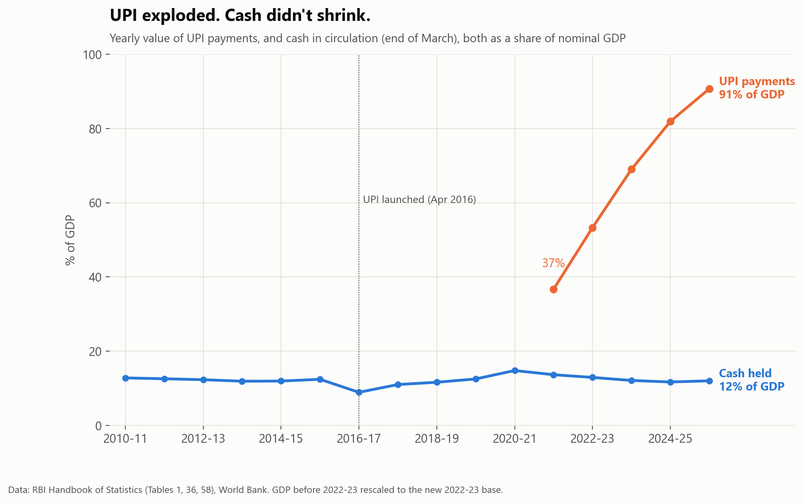
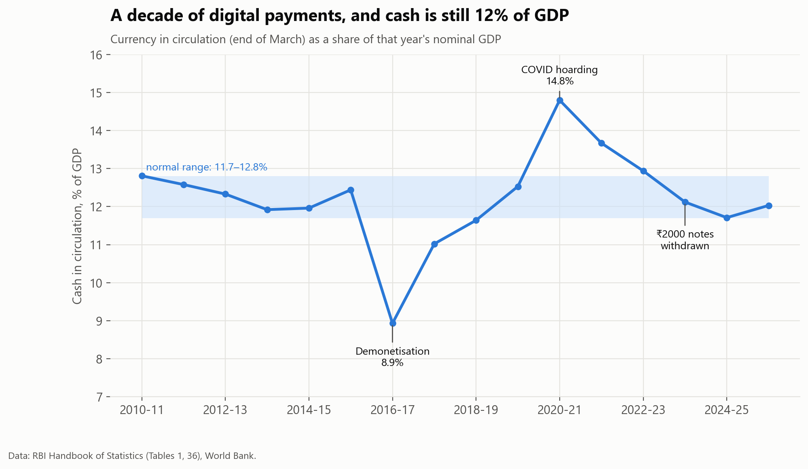
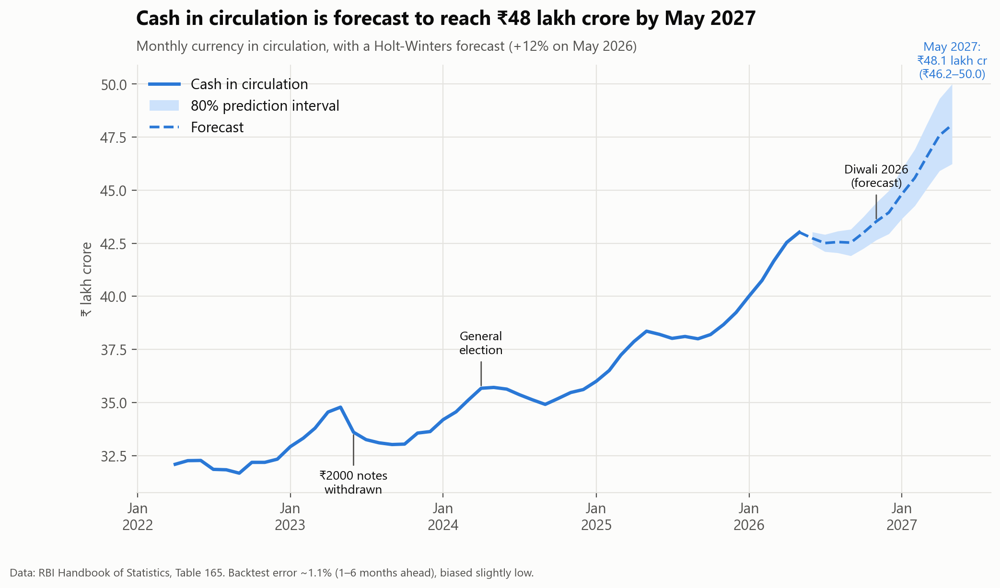
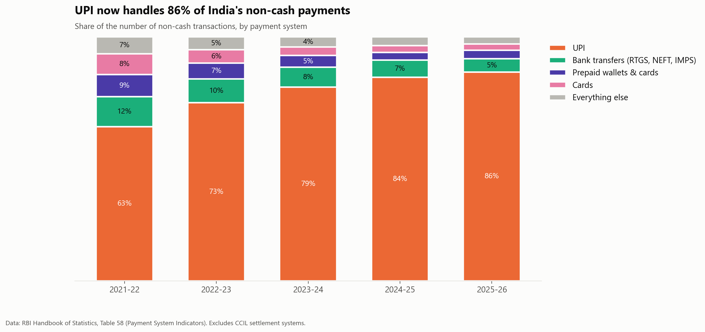
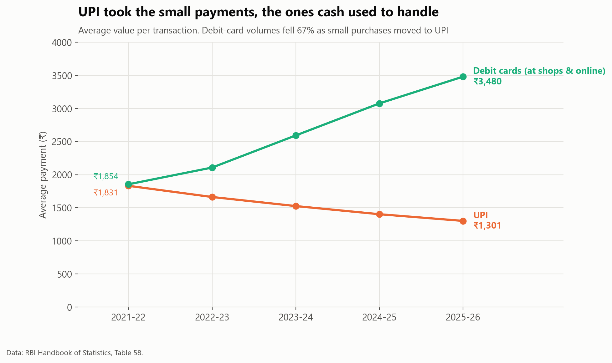

# UPI won. So why is India holding more cash than ever?

In 2025-26 Indians made **242 billion UPI payments** worth ₹314 lakh crore. Over the same year, the cash in circulation grew **11.8% to a record ₹41.7 lakh crore**, its fastest growth since COVID. If digital payments are replacing cash, why does India keep printing more of it?



<!-- business:start -->
## Business impact

- **Question:** UPI won. Should banks plan for less cash?
- **Key finding:** No. Cash is still about 12% of GDP, where it was before UPI existed, while UPI now moves the equivalent of 91% of GDP a year. UPI replaced cash for spending, not for saving.
- **Recommendation:** Plan cash logistics (ATMs, currency chests, note printing) for steady growth, not decline: cash is forecast to reach ₹48 lakh crore by May 2027.
- **Estimated impact:** **1.1%** average error of the cash-demand forecast in a 25-period backtest (forecast: ₹48.1 lakh crore by May 2027, 80% range ₹46.2–50.0).
- **Case study:** [boredmongoose.github.io/projects/upi.html](https://boredmongoose.github.io/projects/upi.html)
<!-- business:end -->

## Short answer

| # | Finding | Evidence |
|---|---|---|
| 1 | **Relative to the economy, cash hasn't grown or shrunk.** It's **12.0% of GDP**, the same as in 2014-15, before UPI existed. | 11.9–12.8% in the six years before demonetisation, 11.7–12.1% in the last three. Demonetisation (8.9%) and COVID (14.8%) pushed it away for a few years each, and it came back |
| 2 | **UPI replaced cash as a way to *pay*, not as a way to *hold* money.** | UPI's yearly value grew from **37% to 91% of GDP** in four years, and it handles **86%** of non-cash transactions |
| 3 | **UPI took the small, everyday payments.** | The average UPI payment fell from **₹1,831 to ₹1,301**. Debit-card transactions fell **67%**, and their average size nearly doubled |
| 4 | **Cash behaves like savings.** It's hoarded in a crisis and follows a seasonal rhythm. | +16.6% in 2020-21 while GDP *shrank*. It builds every October–May and drains every June–September |
| 5 | **Cash growth is speeding up again.** | Forecast to reach **₹48.1 lakh crore by May 2027** (80% range: ₹46.2–50.0), +12% a year |



## How it's built

```
RBI Excel tables  ─┐
World Bank API    ─┼─> Python parser ─> staging CSVs ─> SQL models (DuckDB) ─> marts ─┬─> notebook (charts, forecast)
                   │                                    + 15 data-quality checks       └─> Power BI measures (DAX)
```

**SQL (DuckDB):** all modelling is in [`sql/`](sql). It uses CTEs, window functions (`LAG` for growth, `SUM() OVER (PARTITION BY …)` for shares, `RANK`), `FILTER` aggregates, and a GDP **base-year splice**. India rebased GDP from 2011-12 to 2022-23 prices, so older years are rescaled using the year published on both bases. Without that, the cash-to-GDP ratio would show a fake 3% jump.

**Data-quality checks** ([`07_data_quality.sql`](sql/07_data_quality.sql)). The pipeline stops if any of the 15 checks fails:
- Payment systems sum to RBI's reported totals in every year.
- RBI's *monthly* table matches its *annual* table for every March.
- World Bank GDP matches RBI's figures exactly where both exist.
- There are no gaps in the monthly series.

**Forecast:** monthly cash demand is forecast with a rolling-origin backtest (25 forecast origins, 1–6 months ahead):

| Model | Average error | Bias |
|---|---|---|
| **Holt-Winters (chosen)** | **1.12%** | −0.9% |
| Seasonal naive + drift | 1.27% | −1.1% |
| Naive (last value) | 2.80% | −2.4% |



<p float="left">
  
  
</p>

**Power BI (DAX):** [`powerbi/`](powerbi) has measures for reporting on the same marts (time intelligence with `DATEADD`, `REMOVEFILTERS`-based KPIs) and a report theme matching these charts.

## Limitations

- **Cash is a stock (end-March) and UPI value is a flow (summed over the year).** Showing both as % of GDP compares their trends, not their sizes.
- **There's no direct measure of cash *use*** (such as ATM withdrawals). "UPI replaced small cash payments" is inferred from falling ticket sizes and collapsing debit-card volumes.
- **UPI figures start in 2021-22**, the first year in RBI's current handbook table. Earlier figures from other sources weren't mixed in.
- **The forecast has four years of monthly history** and tends to under-predict when cash growth accelerates.

<!-- next:start -->
## Next steps

1. Add ATM withdrawal data, to measure how much cash is actually used, not just held.
2. Break cash demand down by region and note denomination.
3. Re-run the forecast as each month's RBI data arrives and track its errors.
<!-- next:end -->

## Project structure

```
upi-cash-paradox/
├── data/raw/          # RBI Handbook tables 1, 36, 58, 165 (2025-26 edition); World Bank API responses
├── data/staging/      # tidy CSVs
├── data/marts/        # analysis tables (Power BI source)
├── sql/               # 01_staging → 07_data_quality
├── src/               # parse_sources.py, run_sql.py, style.py
├── notebooks/         # upi_cash_analysis.ipynb (+ .py source)
├── powerbi/           # DAX measures, report theme
└── images/
```

## Reproduce

```bash
pip install -r requirements.txt
python src/parse_sources.py   # RBI and World Bank files in data/raw/ -> tidy CSVs in data/staging/
python src/run_sql.py         # SQL models + 15 data-quality checks -> data/marts/
jupyter notebook notebooks/upi_cash_analysis.ipynb
```

The RBI tables (2025-26 edition) are included in `data/raw/` because the RBI site blocks scripted downloads.

*Data: Reserve Bank of India, [Handbook of Statistics on the Indian Economy](https://www.rbi.org.in/Scripts/AnnualPublications.aspx?head=Handbook+of+Statistics+on+Indian+Economy) (Tables 1, 36, 58, 165); World Bank (GDP, population).*
